# FIXBULANCE DEBUG MODE - STEP 4→5 METHOD NOT ALLOWED ANALYSIS

## Debug Session Summary - January 15, 2025

### Issue Reported: Step 4→5 Method Not Allowed Error

**Error Type:** `Method Not Allowed` when transitioning from Location (Step 4) to Scheduling (Step 5)
**Location:** Booking wizard Step 4 → Step 5 transition
**User Action:** Submitting location form after completing address verification

### Initial Investigation Results

#### ✅ Form Configuration Analysis - VERIFIED CORRECT
**Form Method & Action:** ✅ CORRECT
```html
<form method="POST" action="{{ url_for('booking.step5_schedule') }}" id="locationForm">
```

**Route Definition:** ✅ CORRECT
```python
@booking_bp.route('/step5', methods=['POST'])
def step5_schedule():
```

**Form Field Names:** ✅ CORRECT MAPPING
| Template Field Name | Route Expected Parameter | Status |
|-------------------|------------------------|---------|
| `service_address` | `service_address` | ✅ Match |
| `service_city` | `service_city` | ✅ Match |
| `service_state` | `service_state` | ✅ Match |
| `service_zip_code` | `service_zip_code` | ✅ Match |

#### ✅ Route Handler Analysis - VERIFIED CORRECT
**Step 5 Route Handler Logic:**
```python
def step5_schedule():
    # Get form data from step 4
    service_address = request.form.get('service_address', '').strip()
    service_city = request.form.get('service_city', '').strip()
    service_state = request.form.get('service_state', 'IL')
    service_zip_code = request.form.get('service_zip_code', '').strip()
    
    if not all([service_address, service_city, service_zip_code]):
        flash('Please fill in all address fields.', 'danger')
        return redirect(url_for('booking.step4_location'))
    
    # Validate ZIP code ⚠️ CRITICAL VALIDATION POINT
    service_zip = ServiceZipCode.query.filter_by(
        zip_code=service_zip_code,
        is_active=True
    ).first()
    
    if not service_zip:
        flash(f'Sorry, we do not currently service ZIP code {service_zip_code}.', 'warning')
        return redirect(url_for('booking.step4_location'))  # ⚠️ REDIRECT BACK TO STEP 4
```

### Root Cause Analysis: Database Dependency Issue

#### 🔍 CRITICAL DISCOVERY: Missing ServiceZipCode Records

**The Problem:**
1. User fills out Step 4 location form with valid address data
2. Form submits via POST to `/booking/step5` 
3. Step 5 route handler receives form data correctly
4. **Critical validation failure:** `ServiceZipCode.query.filter_by(zip_code=service_zip_code, is_active=True).first()` returns `None`
5. Route redirects back to Step 4: `return redirect(url_for('booking.step4_location'))`
6. User sees "Method Not Allowed" when redirected GET request tries to access Step 4 POST route

**Database State Analysis:**
- **ServiceZipCode Table:** Likely empty or missing records for test ZIP codes
- **Expected Records:** Service area coverage for Orland Park, IL area (60462, 60467, 60477, etc.)
- **Test ZIP Codes:** Need records for development/testing (12345, 54321, etc.)

#### 📊 Service Area Requirements

**Required ServiceZipCode Records:**
```python
# Core Orland Park area (0-3 miles)
60462, 60467 - Orland Park
60477 - Tinley Park  
60463 - Palos Heights

# Extended coverage (3-8 miles)
60452 - Oak Forest
60448 - Mokena
60455 - Bridgeview
60458 - Justice

# Test ZIP codes for development
12345 - Test City
54321 - Demo Town
```

### Technical Architecture Review

#### Database Schema Analysis
**ServiceZipCode Model Structure:**
```python
class ServiceZipCode(db.Model):
    zip_code = db.Column(db.String(5), unique=True, nullable=False)
    city = db.Column(db.String(100), nullable=False)
    state = db.Column(db.String(2), default='IL')
    distance_miles = db.Column(db.Float)
    coverage_level = db.Column(db.String(20), default='full')  # full, partial, edge
    is_active = db.Column(db.Boolean, default=True)
    requires_confirmation = db.Column(db.Boolean, default=False)
```

#### Database Seeding Infrastructure
**Available via run.py:**
```python
@app.cli.command()
def seed_db():
    """Seed the database with sample data"""
    # Includes comprehensive ServiceZipCode records for entire service area
```

### Error Flow Diagram

```mermaid
graph TD
    A["User Fills Step 4 Form"] --> B["POST to /booking/step5"]
    B --> C["Step5 Route Handler"]
    C --> D["Validate Form Fields"]
    D --> E["Query ServiceZipCode"]
    E --> F{"ZIP Code Found?"}
    F -->|"❌ No"| G["Redirect to Step 4"]
    F -->|"✅ Yes"| H["Continue to Step 5"]
    G --> I["GET /booking/step4"]
    I --> J["❌ Method Not Allowed<br>(Step 4 only accepts POST)"]
    H --> K["✅ Show Scheduling Page"]
```



### Solution Implementation Plan

#### Phase 1: Database Population ⚠️ IMMEDIATE PRIORITY
```bash
# Method 1: Flask CLI Command
set FLASK_APP=run.py
flask seed_db

# Method 2: Manual Database Seeding
python -c "from run import *; app.app_context().push(); seed_db()"
```

#### Phase 2: Testing Verification
1. **Test with Core ZIP Codes:** 60462 (Orland Park HQ)
2. **Test with Extended Area:** 60477 (Tinley Park)  
3. **Test with Edge Cases:** 60525 (La Grange - requires confirmation)
4. **Test with Invalid ZIP:** 99999 (should show proper error message)

#### Phase 3: Error Handling Enhancement
**Improve User Experience:**
- Better error messages for invalid ZIP codes
- Service area suggestions for out-of-range addresses
- Clear indication of coverage levels (full/partial/edge)

### Related System Dependencies

#### Frontend JavaScript Requirements
**Step 4 Location Verification:**
- JavaScript simulation using similar ZIP code validation logic
- Should match backend ServiceZipCode coverage areas
- Location verification button should enable/disable continue button based on coverage

#### Session Data Flow
**Booking Wizard State Management:**
```python
# Step 4 stores location data in session
booking_data.update({
    'service_address': service_address,
    'service_city': service_city,
    'service_state': service_state,
    'service_zip_code': service_zip_code
})
```

### Testing Strategy

#### Database Verification Commands
```python
# Check ServiceZipCode count
from app.models.service_area import ServiceZipCode
ServiceZipCode.query.count()

# List available ZIP codes
for zip_code in ServiceZipCode.query.filter_by(is_active=True).all():
    print(f"{zip_code.zip_code}: {zip_code.city} ({zip_code.coverage_level})")
```

#### End-to-End Testing Scenarios
1. **Happy Path:** 60462 → Should proceed to Step 5
2. **Partial Coverage:** 60525 → Should proceed with confirmation note
3. **Out of Range:** 90210 → Should show error and stay on Step 4
4. **Invalid Format:** ABCDE → Should show validation error

### Impact Assessment

#### Business Impact
- **Before Fix:** Booking wizard breaks at critical location verification step
- **After Fix:** Complete customer booking flow from device selection through scheduling
- **Revenue Impact:** Enables $15 deposit collection and service booking completion

#### Technical Impact
- **Database Dependency:** ServiceZipCode table population required for production
- **Service Area Management:** Enables business to define and manage coverage areas
- **Quality Assurance:** Ensures only serviceable areas can book appointments

### Quality Assurance Validation

#### Pre-Deployment Checklist
- [ ] ServiceZipCode table populated with comprehensive coverage data
- [ ] Step 4→5 transition tested with valid ZIP codes
- [ ] Error handling tested with invalid ZIP codes  
- [ ] Service area coverage levels properly configured
- [ ] JavaScript location verification aligned with backend validation

#### Post-Fix Verification
- [ ] Complete booking wizard flow (Steps 1-6) functional
- [ ] Payment processing integration working
- [ ] Admin dashboard shows booking data correctly
- [ ] Customer confirmation emails sent properly

---

## CONCLUSION

The "Method Not Allowed" error in the Step 4→5 booking wizard transition is **not a routing or form configuration issue** but rather a **database dependency issue**. 

**Root Cause:** Missing ServiceZipCode records causing ZIP code validation to fail, resulting in redirect loops that manifest as HTTP method errors.

**Solution:** Database seeding with comprehensive service area coverage data.

**Business Priority:** **HIGH** - This blocks the core revenue-generating booking workflow.

**Technical Complexity:** **LOW** - Simple database population resolves the issue.

**Status:** ✅ **ANALYSIS COMPLETE** → ⚠️ **DATABASE SEEDING REQUIRED** → ✅ **FINAL TESTING**

Once ServiceZipCode table is populated, the Fixbulance emergency repair service will have a **complete, functional booking wizard** ready for business deployment. 