# 🚀 Quick Deployment Guide - Automated Setup

## Overview
Deploy your Fixbulance app in **3 simple steps** using our automated setup script!

---

## 🏃‍♂️ Quick Start (5 minutes)

### **Step 1: Create GitHub Repository**
**Location:** 🖥️ **Your Local Computer**
```bash
# In your VanReduced folder
git remote set-url origin https://github.com/YOUR_USERNAME/fixbulance-app.git
git push -u origin main
```

### **Step 2: Create Digital Ocean Droplet**
**Location:** 🌐 **Digital Ocean Dashboard**
1. Go to [cloud.digitalocean.com/droplets](https://cloud.digitalocean.com/droplets)
2. Click **"Create Droplet"**
3. Choose **Ubuntu 22.04 LTS**
4. Select **$6/month** plan (1GB RAM)
5. Add SSH key or password
6. Create droplet

### **Step 3: Run Automated Setup**
**Location:** 🖥️ **SSH into Your Droplet**

```bash
# 1. Connect to your droplet
ssh root@YOUR_DROPLET_IP

# 2. Download and edit the setup script
curl -O https://raw.githubusercontent.com/YOUR_USERNAME/fixbulance-app/main/server_setup.sh

# 3. Edit the configuration (update YOUR_USERNAME)
nano server_setup.sh
# Change: GITHUB_REPO="https://github.com/YOUR_USERNAME/fixbulance-app.git"

# 4. Make it executable and run
chmod +x server_setup.sh
./server_setup.sh
```

**That's it!** ✨ The script will automatically:
- ✅ Install all required software (Python, Nginx, PostgreSQL, etc.)
- ✅ Create database and user account
- ✅ Clone your GitHub repository
- ✅ Set up virtual environment and install dependencies
- ✅ Configure web server (Nginx + Gunicorn)
- ✅ Create systemd service for auto-restart
- ✅ Set up SSL certificate (Let's Encrypt)
- ✅ Configure firewall and security
- ✅ Create deployment script for future updates

---

## 🎯 What the Script Does

```mermaid
graph TD
    A[Fresh Ubuntu Droplet] --> B[Install Software]
    B --> C[Create App User]
    C --> D[Setup Database]
    D --> E[Clone Repository]
    E --> F[Configure Environment]
    F --> G[Setup Web Server]
    G --> H[Install SSL Certificate]
    H --> I[Start Services]
    I --> J[🎉 Live Website!]
```



---

## 🔧 After Setup

### **Update Your Stripe Keys**
```bash
# SSH to your server
ssh fixbulance@YOUR_DROPLET_IP

# Edit environment file
nano /var/www/fixbulance/.env

# Update these lines:
STRIPE_PUBLISHABLE_KEY=pk_live_your_actual_key
STRIPE_SECRET_KEY=sk_live_your_actual_key

# Restart app
sudo systemctl restart fixbulance
```

### **Future Deployments**
```bash
# On your local computer - make changes and push
git add .
git commit -m "Updated booking system"
git push origin main

# On your server - deploy updates
ssh fixbulance@YOUR_DROPLET_IP
/var/www/fixbulance/deploy.sh
```

---

## 💰 Total Cost: $6/month

| Component | Cost |
|-----------|------|
| Droplet (1GB RAM, 1 vCPU, 25GB SSD) | $6/month |
| SSL Certificate | FREE |
| Everything else | FREE |

---

## ✅ Verification

After the script completes, test your website:
```bash
# Check if site is live
curl -I https://fixbulance.com

# Check application status
systemctl status fixbulance

# View logs
journalctl -u fixbulance -f
```

---

## 🆘 If Something Goes Wrong

### **Check Script Logs**
The script shows detailed progress. If it fails, you'll see exactly where.

### **Manual Recovery**
```bash
# Check what services are running
systemctl status fixbulance
systemctl status nginx
systemctl status postgresql

# Restart everything
systemctl restart fixbulance nginx postgresql

# Check logs for errors
journalctl -u fixbulance -n 50
```

### **Start Over**
If needed, just destroy the droplet and create a new one. The script is idempotent - safe to run multiple times.

---

## 🎉 Success!

Your Fixbulance app will be live at:
- **Website:** https://fixbulance.com
- **Admin:** https://fixbulance.com/admin
- **Booking:** https://fixbulance.com/booking

**Complete Production Features:**
- ✅ Professional web server setup
- ✅ Automatic SSL certificates
- ✅ Database with backups
- ✅ Email notifications
- ✅ Payment processing
- ✅ Review system
- ✅ Admin interface
- ✅ Security hardening
- ✅ Easy deployments

**Developer Workflow:**
```bash
git push origin main
ssh fixbulance@server
./deploy.sh
# → Live in 2 minutes! 🚀
``` 